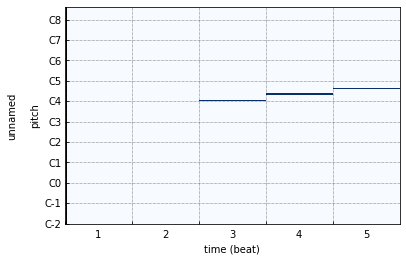

Clip
====

.. hint:: 

    大部分操作符都有一个inplace版本和一个method版本。  点击 :doc:`速查表/Clip <../cheat>` 查看操作符的对应列表。

初始化
------

初始化一个空 ``Clip``

    >>> from infmidi import Clip
    >>> Clip()

使用音符列表初始化。

    >>> from infmidi import Note, Clip
    >>> items = [Note('C4'), Note('E4'), Note('G4')]
    >>> clip = Clip(items)
    >>> clip
    Clip(n_notes)=3, n_events=0, length=1.00)
    >>> clip.notes
    NoteSet([
      Note(name="C4", value=60, frequency=261.63, velocity=127, length=1.00, location=0.00, channel=0),
      Note(name="E4", value=64, frequency=329.63, velocity=127, length=1.00, location=0.00, channel=0),
      Note(name="G4", value=67, frequency=392.00, velocity=127, length=1.00, location=0.00, channel=0)
    ])

列表里元素也可以是 ``Event`` 和 ``Clip``。

    >>> from infmidi import Note, PitchBend, Clip
    >>> item1 = Note('B4')
    >>> item2 = PitchBend(0.5)
    >>> item3 = Clip([Note('C4'), Note('E4'), Note('G4')])
    >>> items = [item1, item2, item3]
    >>> clip = Clip(items)
    >>> clip
    Clip(n_notes=4, n_events=1, length=1.00)
    >>> clip.notes
    NoteSet([
      Note(name="C4", value=60, frequency=261.63, velocity=127, length=1.00, location=0.00, channel=0),
      Note(name="E4", value=64, frequency=329.63, velocity=127, length=1.00, location=0.00, channel=0),
      Note(name="G4", value=67, frequency=392.00, velocity=127, length=1.00, location=0.00, channel=0),
      Note(name="B4", value=71, frequency=493.88, velocity=127, length=1.00, location=0.00, channel=0)
    ])
    >>> clip.events
    EventSet([PitchBend(pitch=0.50, location=0.00, channel=0)])

增删
----

添加 ``Note``

.. code:: python

    # 添加音符（原地修改）
    clip += Note('C4')
    clip.add(Note('C4'))

    # 添加音符（创建副本）
    new = clip + Note('C4')
    new = clip.add(Note('C4'), inplace=False)

    # 不同方法在第4拍的位置添加音符 C4
    clip += Note('C4', location=4)
    clip += Note('C4') >> 4
    clip.add(Note('C4'), 4)
    clip.add(Note('C4') >> 4)
    clip.add(Note('C4') >> 5, 4) # add 方法的 location 会覆盖 Note 本身的 location

删除 ``Note``

.. code:: python

    # 删除第4拍的音符 C4
    clip -= Note('C4', location = 4) # 不存在时不会报错
    clip.discard(Note('C4') >> 4) # 不存在时不会报错
    clip.remove(Note('C4') >> 4) # 不存在时会报错

添加 ``Event``

.. code:: python

    # 第4拍添加PitchBend事件
    clip += PitchBend(0.5) >> 4
    clip.add(PitchBend(0.5), 4) # 

删除 ``Event``

.. code:: python

    # 删除第4拍的PitchBend
    clip -= PitchBend(0.5) >> 4 # 不存在时不会报错
    clip.discard(PitchBend(0.5) >> 4) # 不存在时不会报错
    clip.remove(PitchBend(0.5) >> 4) # 不存在时会报错

添加 ``Clip``

.. code:: python

    # 将 clip1 与 clip2 混合
    clip1 += clip2
    clip1.add(clip2)

    # 将 clip2 添加到 clip1 的第4拍
    clip1 += clip2 >> 4
    clip.add(clip2, 4)

    

转调
----

升调

.. code:: python

    # 所有音符升高5个半音（原地修改）
    clip += 5

    # 所有音符升高5个半音（创建副本）
    new = clip + 5
    new = clip.up(5, inplace=False)

降调

.. code:: python

    # 所有音符降低5个半音（原地修改）
    clip -= 5
    clip.down(5)

    # 所有音符降低5个半音（创建副本）
    new = clip - 5
    new = clip.down(5, inplace=False)

平移
----

    >>> clip = Clip([Note('C4'), Note('E4') >> 1, Note('G4') >> 2])
    >>> plot(clip)

.. image:: ../../_static/imgs/clip/time_shift1.png
    :align: center

使用 ``>>`` 将所有音符和事件沿时间轴往右平移。

    >>> plot(clip >> 2)

缩放
----

.. code:: python

    # 将clip拉伸为原来两倍，长度和位置都会改变
    clip ^= 2

    # 将clip的所有音符长度拉伸为原来两倍，只有长度会改变
    clip *= 2

拼接
----
使用 ``|`` 来拼接 ``Clip``。

    >>> clip = chord('C4:M7') | chord('A4:m7') | chord('F4:M7') | chord('G4:7')
    >>> plot(clip)

.. image:: ../../_static/imgs/clip/concat.png
    :align: center

使用 ``extend`` 拼接多个 ``Clip``。

    >>> clip = Clip()
    >>> clip.extend([chord('C4:M7'), chord('A4:m7'), chord('F4:M7'), chord('G4:7')])
    >>> plot(clip)

.. image:: ../../_static/imgs/clip/concat.png
    :align: center

翻转
----

.. code:: python
    
    # 上下翻转（原地修改）
    clip.invert()

    # 上下翻转（创建副本）
    new = clip.invert(inplace=False)
    new = ~clip

    # 水平翻转（原地修改）
    clip.reverse()

    # 水平翻转（创建副本）
    new = clip.reverse(inplace=False)
    new = reversed(clip)

重复
----

.. code:: python

    # 将clip重复5次（原地修改）
    clip **= 5
    clip.repeate(5)

    # 将clip重复5次（创建副本）
    new = clip ** 5
    new = clip.repeate(inplace=False)
    

通道
----

.. code:: python

    # 将所有音符与事件通道设为9（原地修改）
    clip @= 9
    clip.at(9)

    # 将所有音符与事件通道设为9（创建副本）
    new = clip @ 9
    new = clip.at(9, inplace=False)
    

切片
-----
使用切片可以让你选择特定片段

.. code:: python

    # 获取clip 8拍到16拍的副本
    new = clip[8:16]

    # clip前8拍音符升高7个半音
    clip[:8] += 7

    # 将clip前8拍音符与事件向右平移4拍
    clip[:8] >>= 4

    # 删除clip前四拍音符和事件
    clip[:4] = None
    clip.clear(0, 4)

    # clip 前8拍音符与事件改为通道7
    clip[:8] @= 7