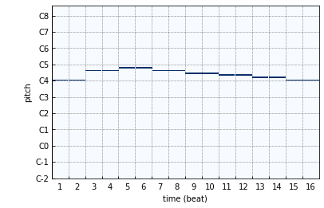

sheet
=====

``sheet`` 函数的语法受lisp语言启发。lisp通过括号来组织任意的代码结构， ``sheet`` 通过括号来确定音符的位置与长度。

- ``|``: 小节分隔符，可以通过 ``beats_per_bar`` 来设置一个小节的长度 (一个小节里的元素平分该长度)。
- ``()``: 分组，括号内的元素平分当前的长度。
- ``-``: 延长上一个音符。
- ``0``: 休止符。

通过合理搭配 ``|``, ``()``、 ``-`` 和 ``0``， 可以很方便的表示任意的节奏。

生成旋律
--------

.. code-block:: python
    
    from infmidi import sheet
    txt = '''
        C4 C4 G4 G4 | A4 A4 G4 - | F4 F4 E4 E4 | D4 D4 C4 -
    '''
    melody = sheet(txt)

生成和弦
--------

用 ``sheet()`` 来生成和弦进行。

.. code-block:: python 

    from infmidi.generator import sheet
    from infmidi.utils import plot

    txt = '''
        A4:m7 | D4:m9   | G4:7 | C4:M7     |
        F4:M7 | B3:m7-5 | E4:7 | A4:m7 A4:7
    '''

    progression = sheet(txt)
    plot(progression)

.. image:: https://raw.githubusercontent.com/gongyibei/infmidi/master/assets/readme/sheet1.png

生成鼓
------

用 ``sheet()`` 来生成一段鼓。

.. code-block:: python 

    # 语法受lisp语言启发， 一个小节和一个括号内的元素平分当前长度
    HitHat = sheet('0 H 0 H | 0 H 0 (H H H) | 0 H 0 H | (0 H) (H H H)', length_per_bar=2)
    Snare  = sheet('0 0 S 0 | 0 0 S 0       | 0 0 S 0 |  0    (S 0)  ', length_per_bar=2)
    Kick   = sheet('K       | K K 0 0       | K       | (K K)  0     ', length_per_bar=2)

    # 进行叠加
    drum = Kick + Snare + HitHat

    plot(drum ** 2)

.. image:: https://raw.githubusercontent.com/gongyibei/infmidi/master/assets/readme/sheet2.png
